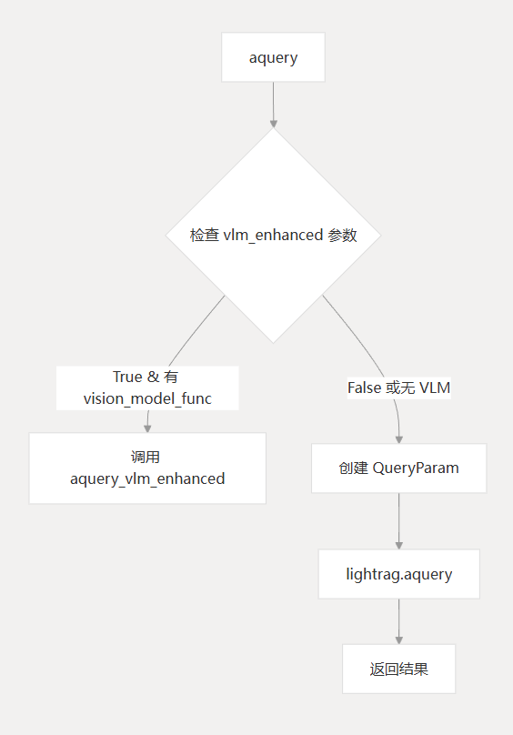
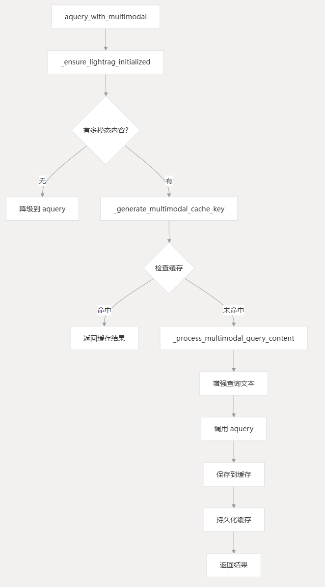
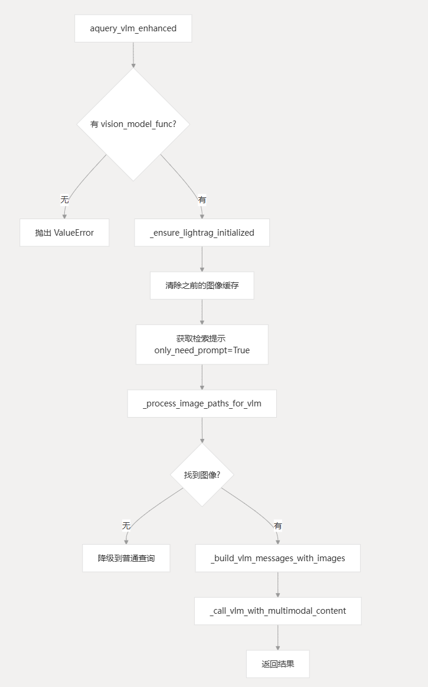

> 简要介绍：
> 在整个RAGAnything项目之中，LightRAG可以称得上的是底座，包含了存储、查询、生成等各方面功能，RAGAnything项目可以说是完全基于LightRAG的
## Query
### 文本查询
文本查询最简单，如果确认没开启视觉增强查询，直接生成即可。

### 多模态查询
对于多模态查询，首先检查用户查询是否存在多模态内容，如果存在，则检查该多模态查询是否存在缓存中，如果存在，直接返回结果，如果不存在，则调用多模态查询处理函数，简单来说就是调用MLLM之类的生成文本描述，最终调用文本查询功能。

### 视觉增强查询
对于视觉增强查询，首先判断MLLM配置是否存在并可用，如果可用，则进行检索，找到相关实体等，之后，获取检索信息中的多模态信息，之后，处理其中的多模态内容，如果找到图像，则组合为多模态Prompt调用MLLM生成答案。

